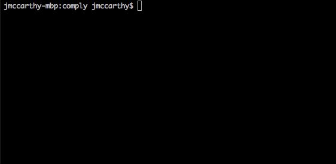
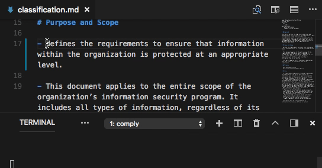
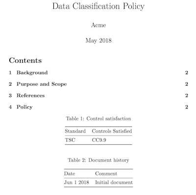
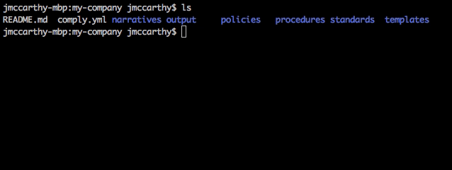
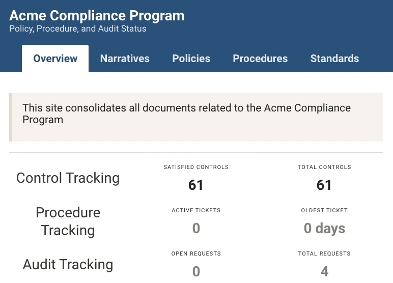

Comply is a SOC2-focused compliance automation tool:

- **Policy Generator**: markdown-powered **document pipeline** for publishing auditor-friendly **policy documents**
- **Ticketing Integration**: automate compliance throughout the year via your existing **ticketing system**
- **SOC2 Templates**: open source policy and procedure **templates** suitable for satisfying a SOC2 audit

# Installation

macOS:

`brew tap strongdm/comply; brew install comply`

Linux:

[Download latest release](https://github.com/strongdm/comply/releases)

Go users:

`go get github.com/strongdm/comply`

# Get Started

Start with `comply init`:

```
$ mkdir my-company
$ cd my-company
$ comply init
```

Once `comply init` is complete, just `git init` and `git push` your project to a new repository. You're ready to begin editing the included policy boilerplate text.

# Discussion

Join us in [Comply Users](https://join.slack.com/t/comply-users/shared_invite/enQtMzU3MTk5MDkxNDU4LTMwYzZkMjA4YjQ2YTM5Zjc0NTAyYWY5MDBlOGMwMzRmZTk5YzBlOTRiMTVlNGRlZjY1MTY1NDE0MjY5ZjYwNWU)

# Screenshots

[Demo video](https://vimeo.com/270257486)

## Start a Project


## Build PDFs




## Track Policy Coverage


## Dashboard


## Dependencies

Comply relies on [pandoc](https://pandoc.org/), which can be installed directly as an OS package or invoked via Docker.

## CLI

```
NAME:
   comply - policy compliance toolkit

USAGE:
   comply [global options] command [command options] [arguments...]

COMMANDS:
     init             initialize a new compliance repository (interactive)
     build, b         generate a static website summarizing the compliance program
     procedure, proc  create ticket by procedure ID
     scheduler        create tickets based on procedure schedule
     serve            live updating version of the build command
     sync             sync ticket status to local cache
     todo             list declared vs satisfied compliance controls
     help, h          Shows a list of commands or help for one command
```

## Running in Docker

Comply is currently only released for Linux and macOS, however from other operating systems it's possible to run using Docker:

```
# first pull the latest published docker image
$ docker pull strongdm/comply

# from an empty directory that will contain your comply project
$ docker run --rm -v "$PWD":/source -p 4000:4000 -it strongdm/comply
root@ec4544732298:/source# comply init
✗ Organization Name:

# serve content live from an established project
$ docker run --rm -v "$PWD":/source -p 4000:4000 -it strongdm/comply
root@ae4d499583fc:/source# comply serve
Serving content of output/ at http://127.0.0.1:4000 (ctrl-c to quit)
```

For Windows users, replace $PWD with the full path to your project directory


## Ticketing Integrations:
- Jira
- Github
- Gitlab

## Configuration

## GitHub

Ticketing integration with GitHub can be configured with the following YAML in `comply.yml`:

```yaml
tickets:
  github:
    repo: github.com/your-org/SOC2
    token: <token>
    username: org-bot-user
```

Also, `GITHUB_REPO`, `GITHUB_TOKEN`, and `GITHUB_USERNAME` can be used to override values from the YAML file.

### Jira

When comply creates a ticket (through `proc`, for instance), it sets the following fields.

- assignee
- description
- issuetype
- labels
- project key
- reporter
- summary

Please make sure that the default *Create Screen* has all of those fields enabled. Additionally, make sure that there are no other required fields for the issue type you choose.


## Forking and local development
> Assumes installation of golang and configuration of GOPATH in .bash_profile, .zshrc, etc
> Inspiration: http://code.openark.org/blog/development/forking-golang-repositories-on-github-and-managing-the-import-path

```
$ go get github.com/strongdm/comply
$ cd $GOPATH/src/github.com/strongdm/comply ; go get ./...
$ make
$ cd example
$ mv comply.yml.example comply.yml
$ ../comply -h
$ ../comply sync
$ ../comply serve
#
$ make # recompile as needed with in $GOPATH/src/github.com/strongdm/comply
```
